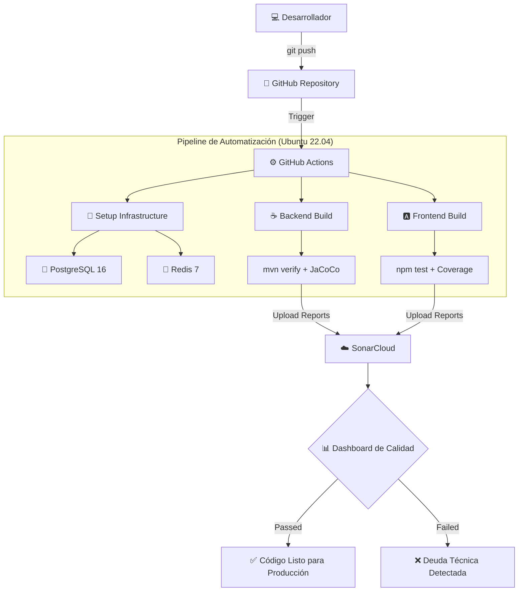

# 📚 Bookshop

Aplicación full-stack de gestión de librería.

## 🛠️ Stack Tecnológico

- **Backend**: Java 21 + Spring Boot 3.4.x (Virtual Threads, Records)
- **Frontend**: Angular 20 (Signals, Zoneless, Control Flow)
- **Caché**: Redis 7
- **Base de datos**: PostgreSQL 16
- **CI/CD**: GitHub Actions + SonarCloud
- **Containerización**: Docker + Docker Compose

## 📁 Estructura del Proyecto
```
bookshop/
├── backend/          # API REST con Spring Boot
├── frontend/         # SPA con Angular
├── database/         # Scripts SQL de inicialización
└── docker-compose.yml
```

## 🚀 Inicio Rápido

### Prerequisitos

- Docker
- Docker Compose

### Ejecutar la aplicación
```bash
# Clonar el repositorio
git clone https://github.com/cavalenzuela/bookshop-app.git
cd bookshop-app

# Iniciar todos los servicios
sudo docker compose up --build
```

### Acceder a la aplicación

- **Frontend**: http://localhost:4200
- **Backend API**: http://localhost:8282
- **Swagger UI**: http://localhost:8282/swagger-ui.html
- **Redis Insight**: http://localhost:8001
- **Base de datos**: localhost:5432

## 🔧 Comandos Útiles
```bash
# Iniciar servicios
sudo docker compose up

# Iniciar en segundo plano
sudo docker compose up -d

# Ver logs
sudo docker compose logs -f

# Reconstruir un servicio específico
sudo docker compose up --build backend

# Detener servicios
sudo docker compose down

# Limpiar todo (incluyendo volúmenes)
sudo docker compose down -v
```

## 📝 Desarrollo Local (sin Docker)

### Backend
```bash
cd backend
mvn spring-boot:run
```

### Frontend
```bash
cd frontend
npm install
npm start
```

## 🗄️ Base de Datos

El script `database/init.sql` genera las tablas en PostgreSQL.

## 📚 Funcionalidades Implementadas

- [x] CRUD completo de Libros, Autores y Categorías.
- [x] Autenticación y Autorización basada en JWT.
- [x] Arquitectura moderna con Java Records y Angular Signals (Zoneless).
- [x] Manejo global de excepciones y validaciones de API.
- [x] Soporte para Virtual Threads (Project Loom) en el backend.
- [x] Caché de datos con Redis para mejorar el rendimiento.
- [x] Documentación interactiva con Swagger/OpenAPI.
- [x] Integración Continua (CI) con GitHub Actions.
- [x] Análisis de calidad de código con SonarCloud.

## 🚀 Infraestructura de CI/CD (GitHub Actions + SonarCloud)

Este proyecto implementa un flujo de **Integración Continua (CI)** profesional que valida automáticamente la calidad y funcionalidad del código en cada cambio.

### � Flujo de Trabajo


### �📋 Características del Pipeline
- **Monorepo Ready**: Análisis independiente para Backend (Java/Maven) y Frontend (Angular).
- **Servicios bajo demanda**: El pipeline levanta automáticamente contenedores temporales de **PostgreSQL 16** y **Redis 7** para ejecutar tests de integración reales en la nube.
- **Cumplimiento 2026**: Configurado para usar **Node 24** y estándares modernos de GitHub Actions.
- **Calidad Profesional**: Integración con **SonarCloud** para detectar bugs, vulnerabilidades y medir la cobertura de tests.

### 🛠️ Guía de Configuración Paso a Paso

#### 1. Preparación en SonarCloud.io
Para mantener el proyecto gratuito y público, se debe realizar una **configuración manual**:
1. Inicia sesión en [SonarCloud.io](https://sonarcloud.io/) con tu cuenta de GitHub.
2. **Crear Organización**: Crea una organización con la key `cavalenzuela` (o la que prefieras, pero debe coincidir con el archivo `ci.yml`).
3. **Creación Manual de Proyectos**: No uses la importación automática. Haz clic en el botón **"+"** -> **Analyze new project** -> **Create project manually**.
4. Crea dos proyectos con las siguientes llaves exactas:
   - **Backend**: Name: `bookshop-app-backend`, Key: `cavalenzuela_bookshop-app-backend`
   - **Frontend**: Name: `bookshop-app-frontend`, Key: `cavalenzuela_bookshop-app-frontend`
5. **Visibilidad**: Asegúrate de seleccionar **Public** para ambos proyectos.
6. **Método de Análisis**: En cada proyecto, ve a **Administration** -> **Analysis Method**, desactiva **Automatic Analysis** y selecciona **GitHub Actions**.

#### 2. Generación del Token de Seguridad
1. En SonarCloud, ve a tu perfil (arriba a la derecha) -> **My Account** -> **Security**.
2. Genera un nuevo token llamado `GITHUB_ACTIONS_TOKEN` y cópialo.

#### 3. Configuración de Secretos en GitHub
1. Entra a tu repositorio en GitHub -> **Settings** -> **Secrets and variables** -> **Actions**.
2. Crea un **New repository secret**:
   - **Nombre**: `SONAR_TOKEN`
   - **Valor**: El token que copiaste de SonarCloud.

#### 4. Variables de Entorno en el Pipeline
El archivo `.github/workflows/ci.yml` ya está preconfigurado con las variables necesarias para los tests:
- `SPRING_PROFILES_ACTIVE: dev` (para cargar la configuración de base de datos de prueba).
- `FORCE_JAVASCRIPT_ACTIONS_TO_NODE24: true` (para compatibilidad con políticas de 2026).

### 📈 Visualización de Resultados
Una vez configurado, cada `git push` disparará el flujo. Puedes ver el estado en:
- **GitHub Actions**: Pestaña "Actions" de tu repositorio (Verifica que el semáforo esté en verde ✅).
- **SonarCloud Dashboard**: Panel visual con métricas de calidad, duplicación y seguridad.