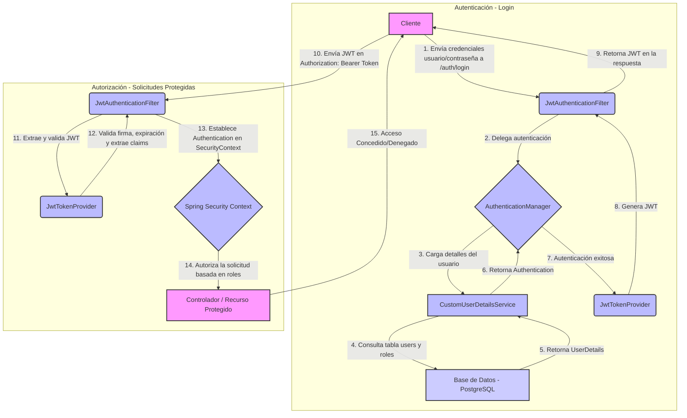

# Bookshop - Backend con Spring Boot   

## Descripción del Proyecto

Bookshop es una aplicación web desarrollada con Spring Boot que implementa un sistema de gestión de una librería.
La aplicación permite realizar operaciones CRUD (Crear, Leer, Actualizar, Eliminar) 
sobre un catálogo de libros, con funcionalidades de autenticación y autorización.

## Características Principales

- **Autenticación de Usuarios**: Sistema de registro e inicio de sesión seguro con JWT.
- **Gestión de Libros**: CRUD completo para el catálogo de libros.
- **API RESTful**: Interfaz de programación para integración con otros sistemas.
- **Documentación Interactiva**: Swagger UI integrado para documentación y pruebas de la API.
- **Caché con Redis**: Implementación de caché para optimizar consultas frecuentes.
- **Base de Datos PostgreSQL**: Almacenamiento persistente de la información.
- **Dockerizado**: Fácil despliegue en cualquier entorno con Docker.
- **Configuración Segura**: Uso de variables de entorno y perfiles de Spring para mayor seguridad.

## Requisitos Previos

- Docker Desktop instalado en tu sistema (si usas Docker para levantar servicios)
- Git (para clonar los repositorios)
- Mínimo 4 GB de RAM asignados a Docker (si usas Docker Desktop)
- **JDK 21** (para compilar y ejecutar el backend; alineado con `pom.xml`)
- **No es obligatorio** tener Maven instalado en el PATH: el proyecto incluye **Maven Wrapper** (`mvnw` / `mvnw.cmd`)
- PostgreSQL (para desarrollo local)

## Maven Wrapper

Este backend usa **Maven Wrapper** para que todos usen la **misma versión de Maven** sin instalar Maven globalmente ni depender del bundle de Maven de IntelliJ.

### ¿Qué es Maven Wrapper?

Es un conjunto de scripts y el directorio `.mvn/wrapper/` que, en la primera ejecución, **descargan** la versión de Maven indicada en el proyecto y la ejecutan de forma reproducible.

### Requisito imprescindible

Solo necesitas un **JDK** correctamente instalado (y, en Windows, conviene definir `JAVA_HOME` apuntando al JDK). El wrapper se encarga de Maven.

### Uso desde la carpeta `backend/`

**Linux / macOS**

```bash
./mvnw clean compile
./mvnw test
./mvnw package
./mvnw spring-boot:run
```

Si `./mvnw` falla por permisos: `chmod +x mvnw` (el repositorio suele versionar el bit ejecutable).

**Windows (CMD o PowerShell)**

```cmd
.\mvnw.cmd clean compile
.\mvnw.cmd test
.\mvnw.cmd package
.\mvnw.cmd spring-boot:run
```

También puedes usar `mvnw.cmd` sin `.\` si tu `PATH` o el directorio actual lo resuelven.

### Archivos del wrapper

| Ruta | Función |
|------|---------|
| `mvnw` | Script para Unix / Git Bash |
| `mvnw.cmd` | Script para Windows |
| `.mvn/wrapper/maven-wrapper.properties` | Define la distribución de Maven (`distributionUrl`, etc.) |
| `.mvn/wrapper/maven-wrapper.jar` | Arranque del wrapper (no editar a mano) |

**Versión de Maven fijada en el proyecto:** 3.9.6 (ver `distributionUrl` en `maven-wrapper.properties`).

### Ventajas

- No requiere Maven instalado en el sistema.
- No depende del Maven embebido del IDE.
- Misma versión de Maven para CI, compañeros y máquinas locales.
- La primera ejecución descarga Maven en la caché del usuario (por ejemplo bajo `~/.m2/wrapper` en Unix o el equivalente en Windows).

### Cambiar la versión de Maven

Edita `.mvn/wrapper/maven-wrapper.properties` y actualiza `distributionUrl`, por ejemplo:

```properties
distributionUrl=https://repo.maven.apache.org/maven2/org/apache/maven/apache-maven/3.9.7/apache-maven-3.9.7-bin.zip
```

La próxima vez que ejecutes el wrapper se usará la nueva versión.

## Estructura del Proyecto

```
backend/
├── src/                    # Código fuente de la aplicación
│   ├── main/
│   │   ├── java/com/bookshop/
│   │   │   ├── config/              # Configuraciones (Security, OpenAPI, etc.)
│   │   │   ├── controller/          # Controladores REST
│   │   │   ├── domain/              # Entidades y DTOs
│   │   │   ├── mappers/             # Mapeadores de entidades (ModelMapper)
│   │   │   ├── repositories/        # Repositorios JPA
│   │   │   ├── services/            # Lógica de negocio
│   │   │   └── security/            # Configuración de seguridad JWT
│   │   └── resources/
│   │       ├── application.yml          # Configuración principal
│   │       ├── application-dev.yml      # Configuración de desarrollo
│   │       └── application-prod.yml     # Configuración de producción
│   └── test/               # Tests unitarios e integración
│       └── java/com/bookshop/
│           ├── controller/          # Tests de controladores
│           └── ...
├── .mvn/wrapper/          # Maven Wrapper (versión de Maven y JAR de arranque)
├── target/                # Archivos compilados (generado automáticamente)
├── mvnw                   # Script wrapper (Linux / macOS / Git Bash)
├── mvnw.cmd               # Script wrapper (Windows)
├── .dockerignore         # Archivos ignorados por Docker
├── Dockerfile            # Configuración para construir la imagen Docker
├── pom.xml              # Configuración de Maven y dependencias
└── README.md            # Este archivo
```

**Nota**: El archivo `.env` se encuentra en la carpeta superior `bookshop-app/` para compartir configuraciones entre servicios.

## Configuración del Proyecto

### Archivos de Configuración

El proyecto utiliza archivos YAML para la configuración, siguiendo las mejores prácticas de seguridad:

1.  **application.yml**:
    - Contiene la configuración base del proyecto
    - No incluye información sensible
    - Define configuraciones generales de la aplicación

2.  **application-dev.yml**:
    - Contiene configuración específica para desarrollo
    - Configuración de base de datos local
    - Configuración específica de Swagger para desarrollo
    - Configuración de JWT y otros parámetros sensibles

3.  **application-prod.yml**:
    - Contiene configuración específica para producción
    - Variables de entorno para bases de datos en producción
    - Configuración de seguridad optimizada para producción
    - Deshabilitación de Swagger en producción

### Variables de Entorno

El archivo `.env` se encuentra en la **carpeta superior** (`bookshop-app/.env`) para compartir configuraciones entre múltiples servicios. Este archivo contiene las variables sensibles necesarias para la aplicación.

## Documentación de la API con Swagger

La aplicación incluye documentación interactiva de la API utilizando **SpringDoc OpenAPI** (Swagger UI). Esta funcionalidad permite:

### Características de Swagger
- **Documentación automática** de todos los endpoints REST
- **Interfaz interactiva** para probar los endpoints directamente desde el navegador
- **Autenticación JWT** integrada en Swagger UI
- **Organización por tags** (libros, autores, categorías, autenticación)
- **Información detallada** de modelos de datos (DTOs)
- **Configuración específica** para entorno de desarrollo

### Configuración de Swagger
- **Dependencia**: SpringDoc OpenAPI 2.8.0 (Compatible con Spring Boot 3.4)
- **Configuración**: `OpenApiConfig.java` con metadatos de la API
- **Seguridad**: Endpoints de Swagger configurados para acceso sin autenticación
- **CORS**: Configurado para permitir acceso desde localhost:8282

### Endpoints de Swagger
- **Swagger UI**: `http://localhost:8282/swagger-ui.html`
- **API Docs JSON**: `http://localhost:8282/api-docs`

## Desarrollo Local

### Requisitos para Desarrollo
- **JDK 21**
- **Maven Wrapper** (incluido en el repo; no necesitas `mvn` instalado)
- PostgreSQL ejecutándose en localhost:5434 (o el puerto que uses en tu `.env`)
- Base de datos `bookshop` creada

### Ejecutar la Aplicación Localmente

1.  **Clonar el repositorio**:
```bash
git clone https://github.com/cavalenzuela/bookshop-app.git
cd bookshop-app
cd backend
```

2.  **Compilar el proyecto** (Linux / macOS):
```bash
./mvnw clean compile
```

En Windows, desde `backend/`:

```cmd
.\mvnw.cmd clean compile
```

3.  **Ejecutar la aplicación**:

Linux / macOS:

```bash
./mvnw spring-boot:run
```

Windows:

```cmd
.\mvnw.cmd spring-boot:run
```

4.  **Acceder a la aplicación**:
- **API REST**: http://localhost:8282
- **Swagger UI**: http://localhost:8282/swagger-ui.html
- **API Docs**: http://localhost:8282/api-docs

### Usar Swagger UI

1.  Abre http://localhost:8282/swagger-ui.html en tu navegador
2.  Explora los endpoints disponibles organizados por tags
3.  Para probar endpoints protegidos:
    - Primero usa `/auth/register` o `/auth/login` para obtener un token JWT
    - Haz clic en el botón "Authorize" en Swagger UI
    - Ingresa: `Bearer <tu-token-jwt>`
    - Ahora puedes probar todos los endpoints protegidos

## Construcción y Despliegue con Docker

### 1. Construcción de la Imagen Docker

Para construir la imagen Docker del proyecto, ejecuta desde la raíz del proyecto:

```bash
sudo docker build -t bookshop-springboot -f Dockerfile .
```

### 2. Ejecución del Contenedor

#### Opción A: Ejecución Básica (para pruebas locales)

```powershell
  sudo docker run -d --name bookshop-springboot-app -p 8282:8282 --env-file ../\.env bookshop-springboot
```

**Explicación de variables de entorno:**
- `SPRING_PROFILES_ACTIVE=dev`: Activa el perfil de desarrollo (carga `application-dev.yml`)
- `JWT_SECRET`: Clave secreta para firmar tokens JWT (cambiar en producción)
- `JWT_EXPIRATION`: Tiempo de expiración del token en milisegundos (3600000 = 1 hora)
- `DATASOURCE_URL`: URL de conexión a PostgreSQL
- `DATASOURCE_USERNAME`: Usuario de la base de datos
- `DATASOURCE_PASSWORD`: Contraseña de la base de datos
- `host.docker.internal`: Alias especial que permite al contenedor acceder a localhost del host

**Nota**: El archivo `.env` está ubicado en `bookshop-app/.env` (carpeta superior)

#### Opción B: Con Docker Compose (recomendado)

El archivo `docker-compose.yml` ya está disponible en la **carpeta superior** (`bookshop-app/docker-compose.yml`). Este archivo contiene la configuración completa para ejecutar la infraestructura necesaria.

Para ejecutar con Docker Compose desde la carpeta raíz del proyecto (`bookshop-app/`):

```bash
sudo docker compose up -d --build
```

El archivo `docker-compose.yml` incluye:
- Servicio **bookshop-springboot**: Aplicación Spring Boot
- Servicio **bookshop-angular**: Aplicación Angular (Frontend)
- Servicio **bookshop-redis**: Motor de caché Redis 7
- Red compartida entre servicios
- Volúmenes persistentes para datos

### 3. Verificar que el contenedor está corriendo

```powershell
# Ver contenedores en ejecución
sudo docker ps

# Ver logs de la aplicación
sudo docker logs -f bookshop

# Detener el contenedor
sudo docker stop bookshop
```

### 4. Acceder a la aplicación

Una vez que la aplicación esté corriendo:
- **API REST**: http://localhost:8282
- **Swagger UI**: http://localhost:8282/swagger-ui.html
- **API Docs**: http://localhost:8282/api-docs

### 5. Configuración del Entorno

**Variables de entorno requeridas:**
- `SPRING_PROFILES_ACTIVE`: `dev` (desarrollo) o `prod` (producción)
- `JWT_SECRET`: Clave secreta para JWT (mínimo 32 caracteres en producción)
- `JWT_EXPIRATION`: Tiempo de expiración en milisegundos
- `DATASOURCE_URL`: URL de PostgreSQL
- `DATASOURCE_USERNAME`: Usuario de BD
- `DATASOURCE_PASSWORD`: Contraseña de BD

**Recomendaciones de seguridad:**
- Cambiar `JWT_SECRET` en producción (usar variable secreta segura)
- No usar credenciales hardcodeadas en imágenes
- Usar secretos de Docker/Kubernetes para información sensible
- Usar PostgreSQL en un contenedor separado o servicio administrado

## Tecnologías Utilizadas

### Backend
- **Spring Boot 3.4.1** - Framework principal
- **Java 21** - Lenguaje de programación (Records, Virtual Threads)
- **Redis 7** - Motor de caché
- **Spring Security** - Autenticación y autorización
- **Spring Data JPA** - Persistencia de datos
- **PostgreSQL** - Base de datos relacional
- **JWT (JSON Web Tokens)** - Autenticación stateless
- **ModelMapper (manual)** - Mapeo moderno entre entidades y Records inmutables
- **Jakarta Validation** - Validaciones robustas en la capa de API

### Documentación y Monitoreo
- **SpringDoc OpenAPI 2.8.0** - Documentación interactiva de la API (Swagger UI)
- **Spring Boot Actuator** - Monitoreo y healthchecks
- **Spring Boot Test** - Framework de testing

### Herramientas de Desarrollo
- **Maven Wrapper** - Gestión de dependencias y construcción sin Maven global
- **Docker** - Containerización
- **Lombok** - Reducción de código boilerplate

## Flujo de Seguridad (Spring Security + JWT)

Este diagrama describe el flujo de autenticación y autorización en la aplicación, utilizando Spring Security y JSON Web Tokens (JWT).



**Explicación del Flujo:**

1.  **Autenticación (Login):**
    *   El **Cliente** envía sus credenciales (usuario y contraseña) a un endpoint de login (ej. `/auth/login`).
    *   El **`JwtAuthenticationFilter`** intercepta esta solicitud.
    *   El filtro delega la autenticación al **`AuthenticationManager`** de Spring Security.
    *   El `AuthenticationManager` utiliza el **`CustomUserDetailsService`** para cargar los detalles del usuario.
    *   `CustomUserDetailsService` interactúa con la **Base de Datos (PostgreSQL)** (tablas `users` y `roles`) para verificar las credenciales y obtener la información del usuario y sus roles.
    *   Si las credenciales son válidas, el `AuthenticationManager` notifica el éxito.
    *   El **`JwtTokenProvider`** es invocado para generar un JSON Web Token (JWT) que contiene la identidad del usuario y sus roles.
    *   El `JwtAuthenticationFilter` retorna este JWT al **Cliente** en la respuesta.

2.  **Autorización (Solicitudes Protegidas):**
    *   Para acceder a recursos protegidos, el **Cliente** incluye el JWT recibido en el encabezado `Authorization` de cada solicitud subsiguiente (como `Bearer <token>`).
    *   El **`JwtAuthenticationFilter`** intercepta estas solicitudes.
    *   El filtro extrae el JWT y lo envía al **`JwtTokenProvider`** para su validación.
    *   `JwtTokenProvider` valida la firma del token, verifica su expiración y extrae la información del usuario (claims).
    *   Si el token es válido, el `JwtAuthenticationFilter` crea un objeto `Authentication` y lo establece en el **`Spring Security Context`**. Esto significa que Spring Security ahora "sabe" quién es el usuario y qué roles tiene.
    *   Spring Security, basándose en la información del `SecurityContext` y las configuraciones de autorización (ej. `@PreAuthorize`), determina si el usuario tiene permiso para acceder al **Controlador / Recurso Protegido** solicitado.
    *   Finalmente, se concede o deniega el acceso al recurso, y la respuesta es enviada de vuelta al **Cliente**.

Este flujo asegura que solo los usuarios autenticados y autorizados puedan acceder a los recursos protegidos de la aplicación.